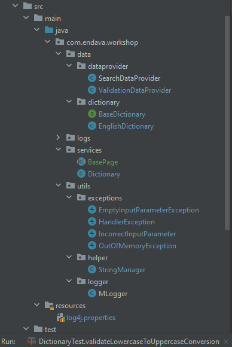

# java-training-2021       
##### Victor Martinez

### General Instructions

1. Plan to spend about 2 hours completing this exercise.
2. Please document any assumptions made.
3. This is a real world exercise. You may use libraries and frameworks as you
   see fit. Solutions found by Google Search or on Stack Overflow are
   acceptable – as long as you understand them.
4. You do not need to connect to a real, online dictionary. The idea is to
   create a mock object to simulate this.
5. Please send your solution as a zip file or send a link to your private
   GitHub repository, so that we can evaluate your work.

### The Problem

Using Java, find all of the English words in a given String. For example, if
you are given the word WORKING, you can easily find WORK and KING, but ROW,
RING and KNOW are also in there. You have access to a utility class called
Dictionary, which has one method, isEnglishWord(String word).
Dictionary.isEnglishWord(String word) connects to a (mocked) online dictionary
and returns Boolean true if the String passed to it is an English word, return
false otherwise.

## English Dictionary

### Requirements 
- A Dictionary Class  with method named isEnglishWord(String word)
- A mocked online Dictionary 

### General Assumptions
- The mocking online Dictionary is consumed through a DictionaryImpl interface: The Implementation of this mocked dictionary is known as an EnglishDictionary.

- In this context an EnglishDictionary is a Set of valid English Words stored in the form of a Collection of Strings.

- English Dictionary is resources-limited as it does not contain all the Existent English words. More concisely,
  the English Dictionary stores substrings derived from the "Working" string. Currently, manages up to 12 words.
  More importantly, English Dictionary preserves the ordering of the String, so a chunked version of the combinations will be implemented. 

- As stated above, EnglishDictionary is a set of words. Words inside the set belongs to English language. Otherwise, it is assumed it is not
  an english word.

- UpperCase String is the protocol assumed for storing the Strings in the dictionary, which is represented in this
  context as a set of Strings. All of the Strings are converted to UpperCase before validating its existence inside the EnglishDictionary.

- It is assumed that the longest english word for this exercise is up to 16 characters in length. A longer string will cause distinct
  system failures as delay, irregular behaviors and out of the memory exception.
  
- Whenever a user types a null input or invalid character string, the program execution crashes and the corresponding exception
  can be seen to the user. No further execution can be done from this point.
    
- Whenever user types an invalid character to the program, following this set of invalid characters null \.[]{}()<>*+-=!?^$|1234567890,
  an InvalidInputParameterException is thrown. No further execution of the program is assumed to be done after this.
  
- This is a first prototype for the problem in question and posterior improvements can be done in the near future to complete the product.
  Client will be patient and happy with the little development steps. 

### Project Structure
The Project follows a General Java project scheme where two big sections can be highlighted as well: Main and Test section.
* A DictionaryImpl interface dictates the necessary methods for a Dictionary instance
  
* A BaseTest defines common adjustments applied before each Test suite

* POM is declared to keep on track of the required dependencies : TestNG and Log4j.

* TestNG Annotations are implemented for setting a correct test flow, besides of validating some common exceptions shown in some Tests

* Two types of DataProviders were included : <strong>SearchPattern</strong> & <strong>ValidationData</strong>. 

* Persistence Layer : The function isEnglishWord() made use of a mocked DataBase in charge of
storing the required dictionary. As many dictionaries could be included, not just an English one, 
  an implementation named BaseDictionary dictates the common methods any dictionary should display.
  
* Logger instances track each event during the Test Suite execution. These logs were stored
in a filed name propertieslogs.txt and shown in console, accordingly. 
  
* <strong>Dictionary Class</strong> only verifies if certain word exists against a limited and customized dictionary (i.e. English Dictionary).

* Multiple exceptions were included for limiting the forbidden states : EmptyInputParameterException,
IncorrectInputParameter and OutOFMemoryException. 

### SubString Engine - First Method - Divide and Conquer Approach  
The first method for obtaining String subsets based on an *Original String* was attacked following a Divide & Conquer 
approach : All the different combinations were obtaining inferring a tree scheme. This approach is contained
in the String Manager and saved us Memory resources as we avoid the O(n) = n^2 and implemented a n*log(n).

This specific method follows a divide and conquer approach. Initially a List is split in half, returning two subLists: the left subList and the right subList.
The left subList is split in half, producing two new subList. This process is repeated up to achieve a unique char level.  The process is repeated by the right subList. 
The process will be stable when all of the possible characters are isolated one from each other. Finally, a combination process is executed over these items to produce 
unique subSets of Strings. 

      *  Arr = {A,B,C}, Result_Before_Combination-> {{A},{B}, {C}}, Result_After_Combination = {A,B,C,AB,AC,BC,ABC, CA, BC,CB,ABC,CAB,BAC,CBA}

#### Drawbacks: 
The main identified drawbacks after having considered and experimented with this recursive approach were:

-   Following a tree scheme would end up dismissing some important combinations. This meant that not all the words could
    possibly be inferred from a base root. 
-   Trying to solve the problem from above put a lot of stress to the performance of the algorithm : The derivation of the missing
    combinations ended up by slowing drastically the velocity of the Test Suite.
-   The max String length possible was up to 16 characters before crashing out by a Memory Heap Exception

By these reasons a new approach had to be applied. 

### SubString Engine - Second Method - Letters Histogram Comparison
The second approach consisted in looking at the problem from the English Dictionary domain: In essence, the set of all the 
valid subStrings derived from a base String is equal to the set of all the words in the dictionary that match the same
or more letters of the base String. So, this histogram comparison approach took away the problem of memory by one hand and the 
combinations' calculation by the other hand : A good trick!

 `Base_Word= "WORKING"`

 `Base_Histogram ={"G:1""I:1","K:1",N:1", "O:1","R:1", "W:1"}`

  `Dictionary:{"OR", "WORK", "IN", "AL"}` 

`Dict_Histogram ={` \
`{"O:1","R:1"}, {"K:1", O:1","R:1", "W:1"},`
`{"I:1","N:1"}, {"A:1", "L:1"}` \
`}`

Based on the content of Base_Histogram and Dict_Histogram, we could inferred the words "OR", "WORK", "IN" from the +
Base Word but not the word "AL" as it was not defined in the Dictionary_Histogram. 

*source* https://codereview.stackexchange.com/questions/166281/find-all-words-in-a-dictionary-that-can-be-made-with-a-string-of-characters-rec

  

